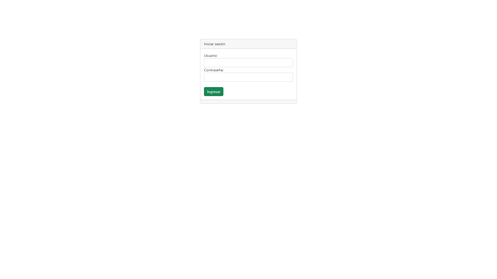
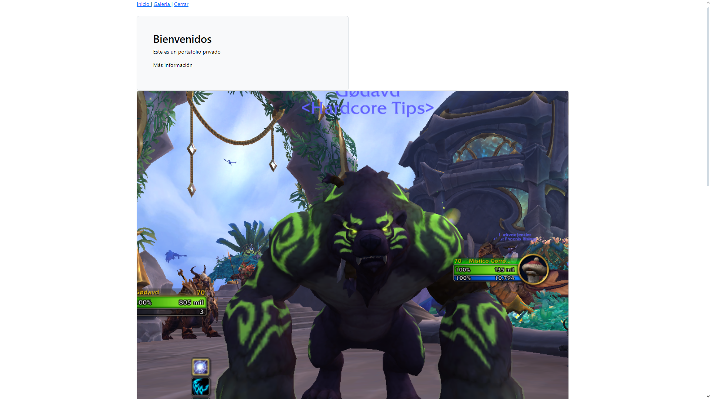
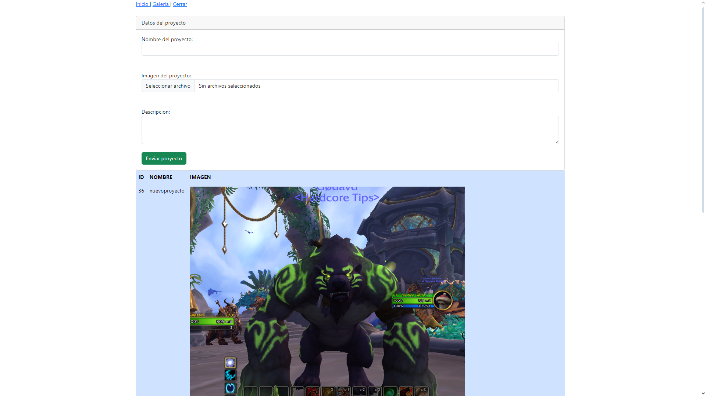

## APLICACIÓN DESARROLLADA EN PHP Y HTML

## HERRAMIENTAS

PHP v8.2.4
XAMPP v8.2.4-0
Composer v2.6.5

## INSTRUCCIONES
1. Descargar el proyecto y guardarlo en el repositorio de Xampp en htdocs

2. Abrir el formulario de index usando la ruta local de la ubicación del archivo.

3. Ingresar el usuario y la contraseña

    User: admin
    Password: 123abc
